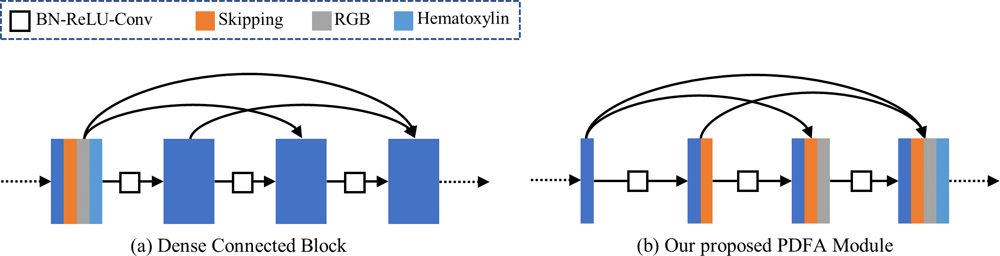

# Triple U-net: Hematoxylin-aware Nuclei Segmentation with Progressive Dense Feature Aggregation


The code of Triple U-net: Hematoxylin-aware Nuclei Segmentation with Progressive Dense Feature Aggregation.
. <br />


[Link](https://www.sciencedirect.com/science/article/abs/pii/S136184152030150X) to Medical Image Analysis paper. 

## Set up requirements
The version information of Triple U-net,please refer to requirements.txt

## Dataset

The CoNSeP dataset as used in our paper was pbuliced in: Hover-Net: Simultaneous segmentation and classification of nuclei in multi-tissue histology images

The MoNuSeg dataset as used in our paper was pbuliced in: A Dataset and a Technique for Generalized Nuclear Segmentation for Computational Pathology

The CoNSeP dataset as used in our paper was pbuliced in:  Methods for segmentation and classification of digital microscopy tissue images


##  Triple U-net
<div align="center">
    
    
</div>

## Citation

If any part of this code is used, please give appropriate citation to our paper. <br />

BibTex entry: <br />
```
@article{zhao2020triple,
  title={Triple U-net: Hematoxylin-aware Nuclei Segmentation with Progressive Dense Feature Aggregation},
  author={Zhao, Bingchao and Chen, Xin and Li, Zhi and Yu, Zhiwen and Yao, Su and Yan, Lixu and Wang, Yuqian and Liu, Zaiyi and Liang, Changhong and Han, Chu},
  journal={Medical Image Analysis},
  pages={101786},
  year={2020},
  publisher={Elsevier}
}
```


