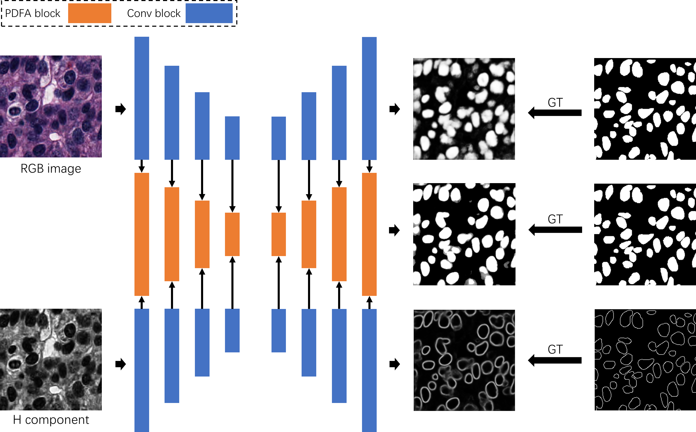

# Triple U-net: Hematoxylin-aware Nuclei Segmentation with Progressive Dense Feature Aggregation

**Triple U-net: Hematoxylin-aware Nuclei Segmentation with Progressive Dense Feature Aggregation**, Bingchao Zhao, Xin Chen, Zhi Li, Zhiwen Yu, Su Yao, Lixu Yan, Yuqian Wang, Zaiyi Liu, Changhong Liang and Chu Han, _Medical Image Analysis,_ 2020. [Paper link](https://www.sciencedirect.com/science/article/abs/pii/S136184152030150X)

<br />
<div align="center">
    
</div>


## Prerequisites

* python==3.6
* torch==1.3.0
* opencv-python==4.1.2.30
* scikit-image
* matplotlib
* numpy 

## Dataset

The CoNSeP dataset is provided by: **Hover-Net: Simultaneous segmentation and classification of nuclei in multi-tissue histology images**

The MoNuSeg dataset is provided by: **A Dataset and a Technique for Generalized Nuclear Segmentation for Computational Pathology**

The CPM-17 dataset is provided by: **Methods for segmentation and classification of digital microscopy tissue images**

## Code
Check the "source/README.md" for more details.

## Download the Model

You can download our trained model via the following Google Drive link.

[Model uploading]()

## Citation

If any part of this code is used, please give appropriate citation to our paper. <br />

BibTex entry: <br />
```
@article{zhao2020triple,
  title={Triple U-net: Hematoxylin-aware Nuclei Segmentation with Progressive Dense Feature Aggregation},
  author={Zhao, Bingchao and Chen, Xin and Li, Zhi and Yu, Zhiwen and Yao, Su and Yan, Lixu and Wang, Yuqian and Liu, Zaiyi and Liang, Changhong and Han, Chu},
  journal={Medical Image Analysis},
  pages={101786},
  year={2020},
  publisher={Elsevier}
}
```


